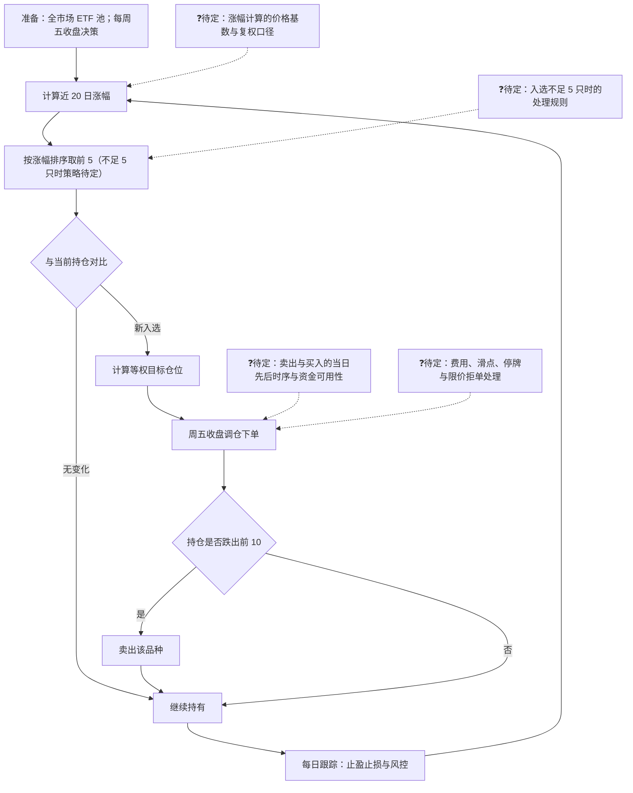
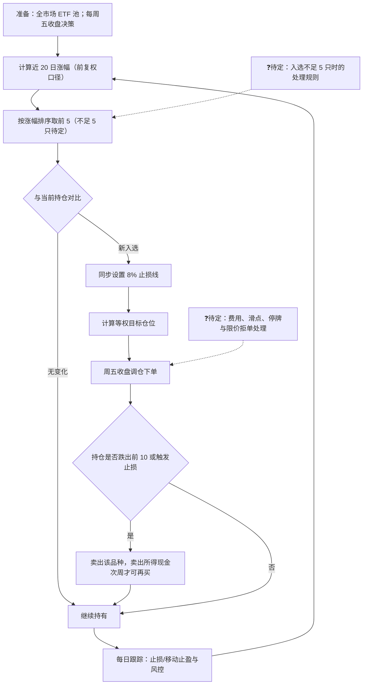

# R0 策略工作流图审核步骤——实施与验收证据

- 日期：2026-08-22
- 变更类别：**skill 层改动（R0 交互流程增强），零框架内核触碰**（engine / provider / 适配层 / 生命周期 / 校验器 / schema 均未改动）
- 版本：skill `0.7.0-framework-repair-f1-f6` → `0.7.1-r0-workflow-review`
- 过程：方案 v1.0 → 独立审核通过（附 3 条补充）→ v1.1 并入 → 用户批准 → 实施 → 验收

## 1. 改动清单（4 文件 8 处编辑）

| 文件 | 编辑 | 说明 |
|---|---|---|
| `skills/quantstudio-strategy-compiler/SKILL.md` | 3 处 | ① 版本串 → `0.7.1-r0-workflow-review`；② 绝对执行规则 3 补句（R0 先展示工作流图）；③ 插入 `### R0-WORKFLOW` 小节（7 条：生成、语法合同、❓待定、免责声明、3 轮上限、闭环不变量、记录） |
| `docs/prompt_engineering.md` | 2 处 | ① R0-VALIDATION-OWNER 段补流程图审核句；② R0-TARGET 硬约束块后新增「R0 工作流图审核」bullet（含闭环规则） |
| `docs/strategy-compiler/USER_GUIDE.md` | 2 处 | ① 步骤 1 展开流程图审核（3 轮上限）；② §4 Spec 确认流程补流程图项 |
| `README.md` | 1 处 | 「让 AI 帮你写策略」段：R0 先出流程图（❓待定节点进确认清单） |

R0-WORKFLOW 关键规则（写入 SKILL.md）：
1. mermaid `flowchart TD` 垂直流向；圆角矩形=处理、菱形=决策、回环=迭代；
2. **语法合同**：节点 `id["label"]`、id 唯一 ASCII、标签双引号包裹、无裸半角标点；
3. **❓待定**：提示词未定义分支画为 `❓待定：<问题>` 虚线节点，禁止自选路径（呼应"Do not choose a material interpretation"铁律）；
4. **免责声明**：图为理解辅助件非合同；权威语义以 R0 审核表与 R2.5 design JSON 为准；R1 探查后自动失效；
5. **重画上限 3 轮**，超限分歧转文字项交 R0 hard stop 裁决；
6. **闭环不变量**：图中❓节点数 ≤ 后续确认清单待定项数；图确认不替代 R0 hard stop；
7. R0→R6 管线阶段数不变；不新增 `user_confirmations` 字段、不 bump 契约版本。

## 2. 验收证据

### 2.1 quick_validate 双副本 PASS
```
PS> python ...\quick_validate.py <proj>  → Skill is valid!
PS> python ...\quick_validate.py <user>  → Skill is valid!
```

### 2.2 双副本一致（install_skill.py 同步）
- 同步命令：`install_skill.py --source <proj> --dest-root C:\Users\Administrator\.agents\skills --force` → `OK: installed + quick_validate PASS`
- 同步前 diff 结论：用户级副本为旧安装（落后于 HEAD，缺已提交的中文命名契约规则 26、平台对齐治理 v4 等），**无用户级独有工作内容**，覆盖安全。
- 同步后逐文件哈希对比：47 个实质文件全部一致；30 个差异项全部为 `__pycache__` 编译缓存（非实质文件，可忽略）。
- SKILL.md SHA-256（双副本相同）：`EF048781DB14CA47623FBA97C6F2867E1A1849E4791E292AEDB32A1340670A25`

### 2.3 功能走查：ETF 动量轮动提示词（示例）
提示词：*"帮我生成一个 ETF 动量轮动策略：每周五收盘后，从全市场 ETF 中选出近 20 日涨幅前 5 的品种，等权买入；如果持仓 ETF 跌出前 10 就卖出。日线回测，2019 年到 2025 年。"*

**第一版流程图（v1，含 4 个 ❓待定）**：



**一次纠错重画（用户指正："入场必须先设止损（8%）；卖出现金次周才可再买"）→ v2（❓ 收敛为 2 个）**：



**mermaid 语法规范静态自检（walkthrough_check.py，双图）**：
```
[walkthrough_v1.mmd] nodes=14 ids_unique=True ids_ascii=True bare_punct=0 pend_markers=4
[walkthrough_v2.mmd] nodes=13 ids_unique=True ids_ascii=True bare_punct=0 pend_markers=2
SELFCHECK: PASS
```

**❓闭环核对表**：

| 版本 | ❓待定节点 | 对应「Present and confirm」清单待决项 | 不变量（❓数 ≤ 待决项数） |
|---|---|---|---|
| v1 | 4（PEND1 时序 / PEND2 费用滑点拒单 / PEND3 复权口径 / PEND4 不足5只） | 4+ 条：复权口径与价格基数、不足 5 只处理、卖出买入当日时序与资金、费用/滑点/停牌/限价拒单（另含决策时钟、基准、T+1 等） | 4 ≤ 4+ ✓ |
| v2 | 2（PEND2 / PEND4） | 2+ 条（复权口径已确认、时序已由用户明确为"次周可用"） | 2 ≤ 2+ ✓ |

**走查结论**：流程图先于矛盾表展示 ✓；用户一次纠错重画（≤3 轮）✓；❓待定闭环进入确认清单 ✓；R0 hard stop 出口闸门不变 ✓；R1–R6 零脚本/零 schema 改动，无回归面 ✓。

## 3. 回退条件与基线

- 写前快照基线（零副作用回退点）：`git stash create -u -m "baseline-r0-workflow-20260822-214526"` → `c8376d81937e4bdb45ca79530c9189e7a393afc7`
- 回退手段：文件级反向编辑优先；必要时 `git reset --hard c8376d81`（仅限本会话改动文件；**不得波及他轨道未提交改动**）。
- 已知他轨道未提交改动（**本改动未触碰**）：`skills/quantstudio-strategy-compiler/SKILL.md` 规则 25（市值/股本因子数据源，f1-f6 轨道）、README.md/prompt_engineering.md 等他轨道大改、`quantstudio/` 引擎侧大批未提交改动。

## 4. 待办

- [ ] 用户确认改动与验收证据（六步流水线第 5 步）
- [ ] 双仓库推送：`git push origin`（双 push URL），推送时 **hunk 级剥离**——仅提交 R0-WORKFLOW 相关 hunk，规则 25 及他轨道改动保持未提交留在工作区；推送后核对两个远程仓库一致（quantstudio-plus / quantstudio）