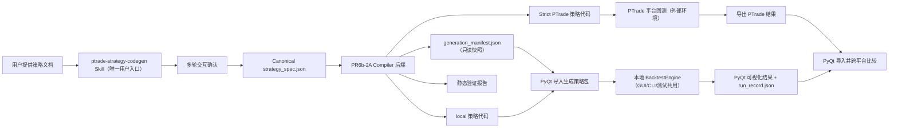

> **2026-07-25 implementation update:** the deferred local PIT universe is now implemented as the separate QuantStudio-only API `get_etf_list_local()`. The original `get_etf_list()` remains PTrade-named and blocked in backtest source. Dual ETF strategies still use a customer-confirmed static whitelist; local-only strategies may use the new API. See `docs/interface-contract.md` and `docs/strategy_toolbox.md`.

# PR6b-2A 实施计划：ETF 静态池轮动垂直切片

> **状态**：APPROVED（批准日期 2026-07-23），作为 PR6b-2A 权威实施基线。未经用户明确下达"开始 PR6b-2A 实施"指令不得开始任何 CP。本文档只定义计划，不含任何已执行代码。
> **创建日期**：2026-07-23
> **范围**：PR6b-2A 包含静态 13 只 ETF 池的 Compiler 后端垂直切片，以及仅限 `backtest_tab.py` + `workers.py` 的最小 PyQt 策略包导入桥接。CP5b 跨平台比较延期为独立 GUI bridge follow-up；动态全市场 ETF 池进入 PR6b-2B（PR6b-2B 继续只负责 PIT-safe universe）。
> **红线**：本计划不修改黄金保护的 `ETF动量.py`/`etf_momentum`；不复制回测引擎；不声称复现视频声称的 62.61% 或 1166% 收益。

---

## 1. 最终产品架构

用户只调用一个 Skill；PR6b-2A 是该 Skill 的后端，不是第二个用户入口。



| 组件 | 职责 | PR6b-2A 是否实现 |
|---|---|---|
| ptrade-strategy-codegen Skill | 唯一用户入口；读文档、多轮确认、调后端、输出策略包 | 否（独立辅助项目，PR6b-2A 完成后另立） |
| **PR6b-2A Compiler 后端** | Spec/IR、ETF 机制、双 Renderer、静态验证、策略包输出 | **是（本计划）** |
| PyQt GUI | 本地回测执行、参数填充、可视化、PTrade 结果导入对比 | 部分（CP5a 本地桥接；CP5b 比较=后续） |
| BacktestEngine | GUI、CLI、自动化测试共用的唯一执行引擎 | 不改动 |
| PTrade 平台 | Strict PTrade 版本的第二执行环境 | 外部条件 |
| PR6b-2B | PIT-safe 动态 ETF universe | 否（后续） |

**架构原则**：
- PR6b-2A 不是第二个用户 Skill，不复制一套回测引擎。
- GUI、CLI、自动化测试共用现有 `BacktestEngine`。
- Codegen Skill 自动流程停在 `STATIC_VALIDATED` / `BACKTEST_NOT_RUN`；用户在 PyQt 运行后才推进状态。
- 反同源循环验证：Reference Oracle 必须独立人工编写，不能把 Codegen/Compiler 产物当 Oracle。

---

## 2. 已决参数（用户裁决，冻结）

| 参数 | 决定 | 依据 |
|---|---|---|
| 静态风险池（13 只，冻结） | 以下 13 只，统一 `.SH`/`.SZ` 标准格式，放 Spec 配置（不硬编码进 Renderer）：`518880.SH`、`513880.SH`、`159770.SZ`、`159819.SZ`、`513100.SH`、`159915.SZ`、`515880.SH`、`513120.SH`、`159755.SZ`、`159652.SZ`、`510500.SH`、`159870.SZ`、`159995.SZ` | ETF动量.py 现有 13 只标准化；小池垂直切片；不声称复现 130+ |
| 防御标的（独立，不计入 13 只风险池） | `511880.SH`（银华日利，etf_daily 有 2018-01-02~2026-07-22 共 2074 条） | 上交所官方确认 + 本地 DB 验证。防御标的独立于风险池，仅 fallback_mode=asset 时使用 |
| 趋势/回归指标数据口径 | **前复权 `fq='pre'`**（与 ETF动量.py:34 一致） | 见 §6 双价格口径分离 |
| 止损口径 | **`position.cost_basis` vs T-1 未复权原始收盘价**，-8%，触发后下一交易日开盘执行 | 见 §6 双价格口径分离 |
| benchmark | Spec/IR 显式 `000300.SH`（不依赖引擎默认） | index_daily 有 000300 共 2070 行 |
| 信号时序 | T-1 完整收盘数据，T 日 `match_price_mode=next_open` 执行 | 禁止未来函数 |
| Top3 | 同时持有评分前 3 只 ETF，等权 | 视频实盘调整 |
| 成本（PR6b-2A 测试基准成本） | `set_commission(commission_ratio=0.00005, min_commission=0.5, type="ETF")` | ETF 无印花税/过户费（type=ETF 清零）。此为测试基准；若用户后续以平台实际账户费率确认不同值，在 Spec 中覆盖 |
| 回归公式 | `log(close)` → `np.polyfit` → `exp(slope×250)-1` → R² → `annualized_return × R²` | 冻结，与 ETF动量.py:50-66 一致 |
| 本地版本生命周期 | PTrade 生命周期 `initialize` / `before_trading_start` / `handle_data`（非 SignalEngine） | PyQt BacktestWorker 固定 `strategy_type="ptrade"`，直接加载 |
| 结果状态回写 | manifest 只读；运行结果仅写 `run_record.json`，不回写 generation 目录 | 见 §8 |
| 第一版 PTrade 运行时语义 | 锁定 Python 3.11 + `is_dict=False` 官方 DataFrame 语义 | 见 §3.4 |

---

## 3. 四项 PTrade 契约修正（基于官方文档，优先于本地兼容层）

> 依据：`D:\miniQMT策略实盘\策略思路\课程量化研究资料\Ptrade量化交易文档.md`
> 本地引擎 `ptrade_api.py` 为兼容历史策略提供了宽松超集，不能作为真实平台契约。

### 3.1 `get_history` 使用 `field=`（单数）
- 官方签名（文档 L1118）：`get_history(count, frequency='1d', field='close', security_list=None, fq=None, include=False, fill='nan', is_dict=False)`
- PTrade Renderer / Codegen 固定使用 `field=['close', 'volume']`，不是 `fields=`。
- 本地扩展 `get_history_batch` 使用 `fields=`（本地专用）。
- **新增 validator**：`PTRADE-FIELD-PLURAL-BAN`，阻断 PTrade 产物中的 `get_history(..., fields=...)`。

### 3.2 `get_etf_list()` 仅 PTrade 客户端交易模块可用
- 官方文档 L2434-2447：仅支持 PTrade 客户端、仅股票交易模块、不支持回测/研究、部分柜台不支持。
- 返回柜台当前 ETF 列表，无历史时点语义。
- 详见 §4 capability matrix。

### 3.3 Position 使用 `cost_basis`（非 `avg_cost`）
- 官方 Position 字段（文档 L2750/2987）：`cost_basis`（每股持仓成本价格）、`last_sale_price`、`amount`、`enable_amount`。
- 本地引擎 `ptrade_api.py:82-90` 同时暴露 `avg_cost` 和 `cost_basis`，是宽松超集。
- **PR6b-2A 所有代码统一使用 `position.cost_basis`，明确禁止 `position.avg_cost`。**
- **新增 validator**：`PTRADE-POSITION-AVG-COST-BAN`，阻断 PTrade 产物中的 `position.avg_cost` / `.avg_cost`。
- **Strict PTrade stub 不得提供 `avg_cost` 属性**，否则测试会掩盖不可移植代码。

### 3.4 `get_history` 返回形态：PTrade Renderer 第一版固定 `is_dict=False`
- 官方文档 L1168-1196（Python 3.11）：
  - 单股字符串 → DataFrame（行=日期，列=行情字段）
  - 多股列表 → DataFrame（含 `code` 列），用 `df.query('code in ["xxx"]')` 取数
- 官方也支持 `is_dict=True`（文档 L1158-1166），但此时返回 `OrderedDict[str, ndarray]`，**不是**本地引擎的 `CodeDict[str, DataFrame]`。
- **PTrade Renderer 第一版固定 `is_dict=False`**，按官方 DataFrame 语义取数。
- 如后续要用 `is_dict=True`，必须另做官方 `OrderedDict[code, ndarray]` adapter，不能直接假设 `history[code]['close']` 在真实 PTrade 可用。

---

## 4. Capability Matrix（动态池三目标）

| 目标环境 | `get_etf_list()` 可用性 | 处理 |
|---|---|---|
| PTrade 实盘交易 | 条件可用（受客户端/柜台限制） | 可生成代码，标记 `PLATFORM_TRADING_ONLY`；需客户端类型检查、柜台能力声明、空列表处理、API 不可用时阻断；不得静默换固定池 |
| PTrade 回测 | **不可用**（官方不支持） | **BLOCK** |
| 本地 QuantStudio 历史回测 | 有兼容实现但读最新日 ETF 列表，**非 PIT** | **BLOCK**（幸存者偏差） |

**结论**：PR6b-2A 只做静态 13 只池。动态全市场池、PIT-safe universe、`get_etf_list` 改造全部进 **PR6b-2B**。PR6b-2B 完成前，动态池不能进入 reference oracle 的正式收益验证。

---

## 5. 双 Stub 测试架构

> 此前 Strategy Compiler 多次缺陷证明：只做 compile/AST 不足以保证生成代码可运行。本地 `ptrade_api.py` 越兼容，越容易把不可移植代码放过去。

### 5.1 Local compatibility stub（宽松）
模拟本地引擎，允许：
- `field=` 和 `fields=` 均可
- `avg_cost` 和 `cost_basis` 均可
- `is_dict=True` → `CodeDict[code, DataFrame]`
- `get_history_batch`（本地扩展）
- `get_etf_list`（本地兼容实现）

### 5.2 Strict PTrade public stub（严格）
只模拟官方公共契约：
- `get_history(..., field=...)`（仅单数）
- `Position.cost_basis`（无 `avg_cost`）
- 无 `get_history_batch`
- `get_etf_list` 在 backtest profile 中直接报 capability error
- `is_dict=False` → 官方 DataFrame 形态
- `is_dict=True` → `OrderedDict[code, ndarray]`

### 5.3 执行规则
- local 生成代码在 local compatibility stub 上执行。
- PTrade 生成代码在 strict PTrade public stub 上执行。
- 两份代码必须分别在对应 stub 上通过 execution-level lifecycle 测试。

---

## 6. 双价格口径分离（约束 1：防止 fq=None 被误解）

> **关键原则**：`fq=None` 仅用于止损的原始收盘价判断；不得被误解为所有指标都必须使用原始价格。

### 6.1 趋势 / 回归 / 成交量信号（指标口径）
- 遵循 Reference Oracle 的指标数据口径。
- 动量计算使用**前复权**数据：`get_history(..., fq='pre')`（与 ETF动量.py:34 一致）。
- 涉及：close>MA20>MA60 趋势过滤、25 日 log-price 回归、R² 评分、成交量排雷（精确公式见 §6.3）。

### 6.2 止损（交易损益口径）
- **持仓成本**：`position.cost_basis`（**禁止 `position.avg_cost`**）。
- **判断价格（唯一冻结路径）**：T 日决策时通过 `get_history(1, frequency='1d', field='close', security_list=code, fq=None, include=False)` 取得 **T-1 未复权原始收盘价**，与 `position.cost_basis` 比较。**不允许使用 `data[code].close` 作为等价备选**——后者引入 Profile 语义和未来函数歧义（与 T-1 信号 / next_open 执行的时序不一致）。未来若要做收盘后决策或分钟止损，应另开 Profile，不在本计划保留双重解释。
- **阈值**：`(cost_basis - T-1原始收盘) / cost_basis >= 0.08` 即触发。
- **执行**：触发后下一交易日开盘执行（`match_price_mode=next_open`）。
- 两套口径必须分离：指标用复权序列保证连续性，止损用原始价反映真实交易损益，混用会因复权因子扭曲跌幅。

### 6.3 成交量排雷（精确冻结时序与窗口）
> 此前"当日量 > MA5×2.5"存在两处歧义："当日量"是 T 日还是 T-1 日；MA5 是否包含被判断日。以下冻结消除歧义，防止未来函数和自包含均值稀释。

- **数据**：T 日开盘前，取成交量序列 `volume`（含 T-1 完整成交量，`include=False`）。
- **判断量**：`signal_volume = volume[-1]`（T-1 完整成交量）。
- **基准均量**：`previous_5d_mean = mean(volume[-6:-1])`（T-2 至 T-6 五日均量，**不含** signal_volume，避免自包含稀释）。
- **触发条件**：`volume_surge = signal_volume > previous_5d_mean * 2.5`。
- **效果**：
  - 未持仓标的：`volume_surge=True` 则从 T 日候选池**排除**。
  - 已持仓标的：`volume_surge=True` 则产生**退出信号**，T 日 next_open 执行。
- **同步要求**（同一公式贯穿）：CP2 实现模块 7、Reference Oracle 冻结公式、Spec/IR 参数定义、local/PTrade 两版 Renderer、execution-level tests 均使用上述精确索引。不得继续保留含糊的"当日量 > MA5×2.5"。

---

## 7. Checkpoint（CP1-CP6，含 CP5a/CP5b 拆分）

### CP1：Canonical Spec + PTrade 严格契约 + manifest schema
**内容**：
- ETF Spec 字段（asset_class=etf、universe、time_model、signals、portfolio、risk、costs、benchmark、target_outputs）
- benchmark 显式 `000300.SH`
- costs 透传（commission_rate / minimum_commission / stamp_tax_rate=0 / transfer_fee_rate=0 / slippage）
- generation status 字段
- PTrade 严格契约：`field=`、`cost_basis`、`is_dict=False`、官方 DataFrame 返回语义
- 静态 ETF universe（13 只，配置化）
- capability matrix（§4）
- `generation_manifest.json` schema（§8）

**验收**（实现后执行）：schema 正向通过 + **4 项独立负向阻断**（分别断言到明确 rule ID，不得合并成一个笼统 portability failure）：
1. `position.avg_cost` 阻断 → `PTRADE-POSITION-AVG-COST-BAN`
2. PTrade `get_history(..., fields=...)` 阻断 → `PTRADE-FIELD-PLURAL-BAN`
3. PTrade `get_history_batch` 阻断 → `PORTABILITY-LOCAL-EXTENSION-BAN`
4. PTrade backtest profile 的 `get_etf_list` 阻断 → `PTRADE-GET-ETF-LIST-BACKTEST-BAN`

### CP2：ETF 静态池 IR 与 9 个实现模块
**内容**（仅覆盖静态 ETF 垂直切片；这是"9 个实现模块"，不是视频完整策略——动态池/130+ 清单/PIT universe 进 PR6b-2B）：
1. 静态 13 只 ETF 风险池（配置化，已冻结代码见 §2）
2. `close > MA20 > MA60` 趋势过滤（持续多头排列，非交叉事件）
3. 25 日 log-price 线性回归（`np.polyfit`）
4. 年化收益率计算（`exp(slope×250)-1`）
5. R² 计算（拟合优度）
6. `annualized_return × R²` 动量评分
7. 成交量异常排雷（精确冻结时序）：T 日开盘前，用 **T-1 完整成交量 `volume[-1]`** 与 **T-2 至 T-6 五日均量 `mean(volume[-6:-1])`** 比较；若 `volume[-1] > mean(volume[-6:-1]) × 2.5`：未持仓标的从 T 日候选池排除；已持仓标的产生退出信号并在 T 日 next_open 执行。对应**持仓异常放量退出**规则
8. Top3 等权持仓
9. `cost_basis` + T-1 未复权原始收盘价 -8% 止损（口径见 §6.2），支持 511880.SH 防御切换（fallback_mode=asset）

**回归边界处理**：<25 日跳过该标的、零方差→R²=0、NaN→排除、负分→参与防御判定。

**明确不属于 CP2**（全部进 PR6b-2B）：
- 动态全市场 ETF 池
- PIT-safe universe / `get_etf_list` 改造
- 130+ ETF 完整清单
- 5 日日均成交额 >5000 万 / 流动性 Top100 / 静态动态池 union

**验收**（实现后执行）：
- 每个 Spec 参数进入 IR（未支持字段不静默丢失）
- 所有 timing 规则通过
- 未知 operation 明确 BLOCK

### CP3：独立人工 Reference Oracle
**文件位置**：`tests/strategy_references/etf_rotation_ref.py`
- **不放** `quantstudio/backtest/strategies/`（GUI 会扫描该目录，易把 reference 当用户可选策略，且与黄金策略混淆）。

**独立性要求**（必须写死）：
- **人工编写的独立 Python 实现**，基于冻结后的 Spec、公式和人工确认参数。
- **不由 ptrade-strategy-codegen 生成**。
- **不由 Compiler Renderer 生成**。
- **不从 generated local/PTrade 代码反推**。
- 包含完整静态 13 ETF 版本的 9 项机制（§CP2）。
- 必须经人工 Review 冻结：冻结公式、冻结异常处理、冻结测试数据、记录 source digest。

**Reference Oracle 与 generated code 的关系必须是**：
```
人工 Reference（独立真值）
    vs
Compiler Local Generated
    vs
Strict PTrade Generated
```
**不能是**：Codegen 产物 → 再作为 Reference → 验证自己生成的代码（同源循环验证）。

**验收**（实现后执行）：Oracle 跑通，产出参考信号/订单/NAV；后续 CP6 才与 generated 结果比较。

### CP4：双 Renderer + 双 Stub + 静态验证 + 策略包
**内容**：
- local renderer（允许 `fields=`、`get_history_batch`、`CodeDict`、本地 batch API）
- strict PTrade renderer（`field=`、`cost_basis`、`is_dict=False`、官方 DataFrame 语义、无 `get_history_batch`、无本地文件/DB 扩展、静态池不调 `get_etf_list`）
- local compatibility stub（§5.1）
- strict PTrade public stub（§5.2）
- execution-level lifecycle 测试（initialize → before_trading_start → handle_data，观察信号/订单）
- variant consistency（两版信号规则一致）
- strategy package 输出（§8 目录结构）

**验收**（实现后执行）：
- local 代码在 local stub 执行通过
- PTrade 代码在 strict stub 执行通过
- strict stub 不提供 `avg_cost`，PTrade 代码无本地 API
- 两版信号规则一致
- package/manifest 完整

### CP5a：PyQt 生成策略包导入与本地回测入口
**职责限定**：
- 扫描 `output/generated_strategies/`
- 读取 `generation_manifest.json`
- 选择 local strategy
- 自动填充成本、benchmark、profile、match price
- 调用现有 BacktestEngine
- 打开已有结果可视化窗口

**只允许修改以下 2 个文件**：
- `quantstudio/gui/tabs/backtest_tab.py`
- `quantstudio/gui/workers.py`

**CP5a 开始前必须先记录既有 GUI 改动**：
```
git diff --name-only
git diff --stat
```
CP5a 只允许触碰上述 2 文件的**新增范围**，不得修改既有未提交改动。

**不得修改**：
- `main_gui.py`
- `quantstudio/gui/main_window.py`
- 其他 GUI tab（browser/config_editor/quality/source/task 等）
- `quantstudio/gui/backtest_result_window.py`
- 数据管线
- BacktestEngine 核心
- 黄金策略
- 现有 GUI 未提交改动

**验收**（依赖 GUI 改造后执行）：PyQt 能导入生成策略包、读 manifest、自动填参数、调 BacktestEngine 回测、生成 run_record、打开可视化。

### CP5b：PTrade 结果导入与跨平台比较（接口设计）
**定位**：如不在本 PR 实现，明确延期为后续 GUI bridge checkpoint。

PTrade 结果导入/比较可能需要：
- 新的 result importer
- 新的 comparison service
- 或修改 `backtest_result_window.py`

**如果**已有 `backtest_result_window.py` 足够读取统一格式 → 只增加调用入口。
**如果不够** → 必须单独列为后续变更，**不得隐含扩大 CP5a 范围**。

CP5b 如需修改 `backtest_result_window.py` 或新增 comparer，必须单独列出文件 ownership。

**比较分层**（CP5b 设计目标）：
- L1 信号/订单层（日期/标的/方向/数量/触发原因/Top3/止损/防御切换）
- L2 指标层（总收益/年化/最大回撤/Sharpe/胜率/交易次数/benchmark 收益）
- L3 NAV 层（每日净值偏差/最大偏离/最终资产差异/回撤曲线差异）

### CP6：端到端验收
**最小必验收路径**：
```
Canonical Spec → strategy package → PyQt 导入 → 读取 manifest → 自动填充参数
→ 本地 BacktestEngine → 可视化结果 → run_record.json
```
PTrade 真实平台回测受外部账号/平台/结果导出条件影响。

**验收矩阵分 4 层**（见 §9）。

---

## 8. generation_manifest.json（只读快照）+ run_record.json（独立运行目录）

### 8.1 generation_manifest.json：生成时写一次，只读
路径：`output/generated_strategies/<strategy_id>/generation_manifest.json`

```json
{
  "manifest_version": "1.0",
  "strategy_id": "etf_regression_rotation_v1",
  "build_id": "<代码版本 hash>",
  "display_name": "ETF回归动量轮动",
  "asset_class": "etf",
  "profile": "daily-bar-v1",
  "benchmark": "000300.SH",
  "local_strategy_path": "local/etf_regression_rotation_v1_local.py",
  "ptrade_strategy_path": "ptrade/etf_regression_rotation_v1_ptrade.py",
  "generation_status": "STATIC_VALIDATED",
  "backtest_status": "NOT_RUN",
  "ptrade_status": "NOT_RUN",
  "live_status": "NOT_ASSESSED",
  "default_backtest": {"start": null, "end": null, "capital": 100000},
  "costs": {
    "commission_rate": 0.00005,
    "minimum_commission": 0.5,
    "stamp_tax_rate": 0.0,
    "transfer_fee_rate": 0.0,
    "slippage_bps": 0.0
  },
  "execution": {"match_price_mode": "next_open", "etf_t0": false},
  "source_document": {"path": null, "sha256": null},
  "known_limitations": []
}
```
- 具体费率最终以确认后的 Spec 为准，上述只是结构示例。
- **生成后只读，不回写运行结果**。
- **GUI 不得回写 generation 目录中的 `generation_manifest.json`，也不得修改 `strategy_spec.json`。**

### 8.2 run_record.json：每次回测单独创建
路径：`output/backtest_runs/<strategy_id>/<run_id>/`

```
output/backtest_runs/<strategy_id>/<run_id>/
├── run_record.json
├── config.csv
├── trades.csv
├── daily_stats.csv
├── benchmark.csv
└── metrics.json
```

```json
{
  "run_id": "<运行实例 id>",
  "strategy_id": "etf_regression_rotation_v1",
  "strategy_build_id": "<对应 manifest 的 build_id>",
  "variant": "local",
  "manifest_path": "...",
  "strategy_path": "...",
  "start": "...",
  "end": "...",
  "costs": {},
  "benchmark": "000300.SH",
  "engine_profile": "daily-bar-v1",
  "status": "LOCAL_BACKTEST_COMPLETED",
  "result_dir": "..."
}
```

### 8.3 build_id vs run_id（明确区分）
- **`build_id`** = 这份代码的版本（manifest 生成时确定，对应一份生成代码）。
- **`run_id`** = 这次回测运行的实例（每次回测新建一个）。
- 同一个 `strategy_id` 可以有多个 `run_id`（多次回测）。
- 同一个 `build_id` 可以被多个 `run_id` 引用（同一份代码跑多次）。

### 8.4 分工原则
- **manifest = 这份代码是什么**（生成契约，只读）。
- **run_record = 这次代码跑出了什么**（运行结果，每次新建）。
- 两者分离，避免"代码定义"与"运行结果"纠缠。

### 8.5 成本唯一真源与覆盖优先级（不变量）

当前计划中成本可能出现在 5 处：`Spec.costs`、`generation_manifest.costs`、GUI 参数、Worker 构造的 `TradeCost`、策略 `initialize` 中的 `set_commission`。为避免无规则互相覆盖（尤其用户在 GUI 改佣金后，策略 `set_commission()` 又覆盖 GUI 设置），规定以下不变量：

- **`Spec.costs` 是唯一真源。**
- `generation_manifest.costs` 是从 `Spec.costs` 派生的只读快照。
- PyQt 默认值从 manifest 填充（用户可改 GUI 输入框，但默认来自 manifest）。
- local/PTrade Renderer 的 `set_commission` 同样从 `Spec.costs` 派生。
- **静态验证不变量**：生成时若 `Spec.costs`、`manifest.costs`、rendered code 中 `set_commission` 三者不一致 → **BLOCK**。
- **用户 GUI 手动改成本**：仅写入本次 `run_record`，不修改 manifest 或 Spec。

**GUI 手动成本与策略内 `set_commission` 的优先级**：
- **默认**：策略使用 Spec 冻结成本（`initialize` 中 `set_commission` 生效，GUI 成本输入框填 manifest 值作展示）。
- **敏感性测试**：GUI 显式设置 `override_costs=true` 时，Worker 在 `initialize` 执行**之后**应用运行级成本覆盖（重新调用 `set_commission` 或覆盖 `engine.cost`），并记录进 `run_record`。`override_costs=false` 时忽略 GUI 成本输入，使用策略内值。
- **不允许**两边无规则互相覆盖：要么策略内 `set_commission` 生效，要么 GUI 显式 override 后生效，二选一且 `run_record` 记录实际用了哪个。

**slippage 单位转换（不变量）**：
- `Spec.costs` / `manifest.costs` 使用 `slippage_bps`（基点，如 5.0 = 5bps）。
- `BacktestEngine.TradeCost.slippage_rate` 使用比例值。
- **转换公式**：`slippage_rate = slippage_bps / 10000.0`（例：5bps → 0.0005，20bps → 0.002）。
- `run_record.json` 同时记录两者，避免 GUI / manifest / Worker / TradeCost 对同一数值使用不同单位：
  ```json
  {"slippage_bps": 5.0, "slippage_rate": 0.0005}
  ```
- 当前 PR6b-2A 测试基准 `slippage_bps = 0.0`，本约束只防单位歧义，不改变基准。

---

## 9. 验收矩阵（逐 CP；约束 6：区分计划命令与现有命令）

> **注意**：以下命令为**计划目标命令**（实现后执行），不是当前已可执行的验收证据。每条标注依赖条件。

| CP | 验收内容 | 目标命令 / 方法 | 依赖条件 | 层级 | 预期 |
|---|---|---|---|---|---|
| CP1 | schema + validator | `validate_strategy_spec` + 新增 PTrade validators | 实现后 | 自动 | 正向通过 + **4 项独立负向阻断**（见 §CP1） |
| CP2 | IR 构建 | `build_strategy_ir(etf_spec)` + `validate_strategy_ir` | 实现后 | 自动 | 参数透传 + timing 通过 |
| CP3 | Oracle 回测 | `python -m pytest tests/...etf_rotation_ref` 或 CLI 回测 | 实现后 | 自动/项目环境 | 跑通有 NAV/交易 |
| CP4 | 双 Renderer + 双 stub | execution-level tests（local stub + strict stub） | 实现后 | 自动 | 两版各自通过 |
| CP5a | PyQt 导入回测 | GUI 操作：导入包 → 回测 → 可视化 | 依赖 GUI 改造 | 项目环境 | run_record 生成 |
| CP5b | PTrade 结果比较 | 导入 PTrade 结果 → L1/L2/L3 比较 | 依赖 comparer/导入接口 | 有结果文件时 | 比较报告 |
| CP6 | 端到端 | Spec→包→PyQt→回测→run_record | CP1-5a 完成 | 项目环境 | 全链路通 |

**CP6 四层验收边界**（约束 5）：

| 层级 | 内容 | 是否自动 | PASS 条件 |
|---|---|---|---|
| 生成/静态 | Spec、IR、双 Renderer、PTrade strict validator、双 stub | 自动 | 全绿 |
| 本地回测 | PyQt 调现有 BacktestEngine、生成 run_record、可视化 | 项目环境 | run_record + 可视化正常 |
| PTrade 平台 | 用户将 strict PTrade 代码放入实际平台回测 | **外部条件** | 平台可用时 |
| 跨平台比较 | 导入 PTrade 结果文件后比较信号/交易/NAV | **有结果文件时** | 比较报告生成 |

**诚实状态规则**：
- PTrade 平台不可用时，**不得**把 `PLATFORM_RESULT_IMPORTED` 标记为 PASS。
- 没有 PTrade 结果文件时，`CROSS_PLATFORM_COMPARED` **必须**是 `NOT_RUN`。
- 不能因为当前没有 PTrade 结果，就把后续状态标成 PASS。

---

## 10. 未决项（需后续确认，不阻塞计划）

> 以下为**真正未决**项。已冻结的决定（本地 PTrade 生命周期、manifest 只读/run_record 独立、Python 3.11 + is_dict=False、ETF 测试基准成本）已在 §2 已决参数中记录，不再列于此。

| 未决项 | 说明 |
|---|---|
| 130+ ETF 完整清单 | 视频未给完整代码；到位后只换配置（PR6b-2B） |
| PTrade 结果导出格式 | 用户实际能从平台导出哪些文件和字段（影响 CP5b importer） |
| PyQt 比较字段映射 | NAV/trade/metrics 的字段映射（影响 CP5b comparer） |
| 共同数据区间 | 13 只 ETF 共同有效历史区间（影响默认回测日期） |
| build 覆盖规则 | 重新生成时覆盖、版本化还是创建新 build_id |
| PTrade 动态池实盘代码 | PR6b-2B 前是否允许提前生成（建议保持 BLOCK） |
| 货币基金 511880 长窗口 | 更长窗口的流动性/成本规则细化 |

---

## 11. PR6b-2B 边界（PIT-safe 动态 ETF universe）

PR6b-2B 专门解决：
- date-aware ETF universe（`get_etf_list(query_date)`）
- ETF 上市/退市日期
- PIT 当日可交易列表
- 当日是否有足够历史数据
- 当日成交额
- 历史时点 ETF 身份
- 5 日日均成交额 >5000 万
- 流动性 Top100
- 静态/动态池 union + deduplicate
- 幸存者偏差测试
- PTrade live-only `get_etf_list` capability
- PTrade 回测不支持动态池的诚实 BLOCK

**PR6b-2A 只使用静态 13 只池。PR6b-2B 完成前，动态池不能进入 reference oracle 的正式收益验证。**

---

## 12. 实施红线

1. **不改黄金保护**：不修改 `ETF动量.py` / `etf_momentum`（render.py:32 + strategy_fidelity_gates.json）；复制为新 strategy_id。
2. **未来函数禁止**：全部信号 T-1 完整收盘，T 日 next_open 执行。
3. **cost_basis 强制**：统一 `position.cost_basis`，禁止 `position.avg_cost`；新增 validator 阻断。
4. **双价格口径分离**：指标用前复权 `fq='pre'`，止损用 `fq=None` 取 T-1 未复权收盘（唯一路径，禁 `data[code].close` 备选）；不混口径。
5. **cost 透传 + 唯一真源**：Spec.costs 渲染进 set_commission（关 dim13 GAP）；Spec.costs 是唯一真源，manifest/rendered code 派生自它，三者不一致则 BLOCK；GUI 改成本仅写 run_record，override_costs 显式控制优先级（见 §8.5）。
6. **双 stub**：local stub + strict PTrade stub；生成代码各自在对应 stub 执行。
7. **不声称复现业绩**：不宣称复现视频 62.61% / 1166%；静态池是小池垂直切片。
8. **生成产物不写入内置目录**：只写 `output/generated_strategies/`，绝不碰 `quantstudio/backtest/strategies/`。
9. **反同源循环验证**：Reference Oracle 独立人工编写，不能来自 Codegen/Renderer。
10. **PTrade 契约优先**：官方文档优先于本地兼容层；`field=`（非 fields）、`cost_basis`（非 avg_cost）、`is_dict=False`。
11. **CP5a 文件边界**：只改 backtest_tab.py + workers.py，先记录既有 GUI diff。
12. **manifest 只读**：GUI 不回写 generation 目录；结果写独立 run_record。
