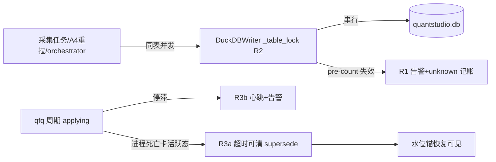

# R1-R3 写入完整性修复方案（write-integrity-r123）

状态：六步①方案阶段（呈审稿 v1）· 立项依据：总调度 2026-10-08 采信令（⓪①② 定谳 + R1-R3 立项照准）
取证基础：D:\dsh-sync\mainqueue-012-20261008\EVIDENCE.md（三案证据链，不再复述）
作者：主仓 dev 会话 · 2026-10-08 02:35

## 0. 判型声明（修复前置纯增益审计，preset §1-⑧）

| 项 | 判型 | 依据 |
|---|---|---|
| R1 记账失效告警 | **新增检测型**（附记账口径修正说明） | 不改任何写入数据语义（INSERT ON CONFLICT 原样）；仅当 pre-count 失败时把「假新增」改为「unknown+告警」——原本静默虚报的位置将来显示真相。batch_checkpoint.rows_new 在失效批写 -1（哨兵），属审计账本口径修正，非行情数据修正 |
| R2 per-table 写互斥 | **纯恢复型** | 写入结果与串行执行完全一致（消除的是同进程并发冲突导致的整任务作废）；断点续传已存在（_open_day_resume v3.1 R2 游标），无新增语义 |
| R3a 死周期清障补洞 | **纯恢复型** | 把 supersede_stale_intents 设计意图（清残留 pending）补全到「周期卡活跃态+进程已死」场景；恢复正常清障路径 |
| R3b applying 停滞 watchdog | **新增检测型** | 停滞从静默变为心跳+告警；不自动改周期状态、不自动提交水位（fail-closed） |

三项均不触碰回测引擎/取数 API/QFQ 计算语义（性能优化铁律的边界外）；纯增益自检：R1 零行为变化（仅日志/账本口径）、R2 消除作废重跑、R3 恢复清障+新增可见性，无「修一送一」面。

## 1. 问题定义（三案浓缩）

P-R1（取证⓪）：DuckDBWriter upsert 记账 pre-count（writers.py L870-877）except 静默置 0 → 失效批全量误标「新增」（实证：10-03 晚间 etf_minutes 1376 批 65.9M 全「新增」而表内确有其中 4.89M 段）。虚报不丢数据，但污染审计账本与监控口径，且掩盖真实异常（何种异常使 pre-count 失效至今未知——异常被吞）。

P-R2（取证②）：同进程并发写者对同表同 key 双写 → DuckDB TransactionContext write-write conflict（23 次：FAIL×7 长任务 commit 死 + A4WARN×11 + OTHER×5；key 样本 "000055, 1788744600000, 1min"）。T1 退避（_open_rw_with_backoff）只防跨进程文件锁。代价：任务作废（断点后残余重跑）+ A4 缺口重拉持续失败 + stock_minutes 水位停滞 09-24。

P-R3（取证①）：qfq 协调周期 applying 相位可停滞 6.5h+ 无任何周期面日志（10-03 11:05→17:41 实证），进程死亡后周期卡活跃态；supersede_stale_intents（qfq_resident_orchestrator.py L318-338）只认 status IN ('finalized','finalized_held','failed','interrupted') 或周期行不存在——**卡活跃态的死周期永不命中** → 11 条 pending 挂 5 个死周期，水位锚不可见 → 下任务 last_watermark=None → 66M 行全年重拉（⓪ 放大器）。

## 2. 改动范围（文件/锚点）

### R1 writers.py（_write_upsert 记账段 L870-932）
- L870-877 pre-count except：改为 捕获→logger.warning（含 table/batch_id/异常类型与文本）→ 单次重试（新连接）→ 仍失败则 accounting_unknown=True。
- new/updated 计算：accounting_unknown 时 new_rows=-1、updated_rows=-1（哨兵），日志行 L929-930 打「新增 ? + 更新 ? （记账失效：{err}）」；WriteResult 不变结构（int 语义仍 len(df)，.new/.updated 取 -1）。
- 消费端适配：daemon.py L1177/1360（rows_written=wr；write_new/write_updated 累计处 L1287）对 -1 哨兵跳过累计并在汇总行 L1193-1194/L1396-1397 标注「new=? (accounting-degraded)」；batch_checkpoint 落账（daemon.py L108-111）rows_new/rows_updated 写 NULL。
- 正常路径行为逐位不变（pre-count 成功时新增/更新计算公式原样）。

### R2 writers.py（DuckDBWriter 类级）
- 新增 `self._table_write_locks: Dict[str, threading.RLock]` + `_table_lock(table)` helper（缺省建锁）。
- 写事务临界区包覆：_write_upsert（L88x-932 段，从 conn 获取到 commit/close）与 _write_passthrough（L937+，CREATE OR REPLACE 全覆盖）两处 `with self._table_lock(table):`。进程内同表串行；跨表不互斥（无收益）；跨进程仍走 T1 文件锁退避（不变）。
- 锁范围最小化：仅写事务段（pre-count 探测可留在锁外——它只读；但为避免探测/写入间窗口错配，探测+写入同入临界区更稳——**采纳同入**，代价是同表探测也串行，可接受：探测为毫秒级）。
- 不改 daemon 编排、不改 A4 检测、不改调度（最小落点；DuckDBWriter 是全部写者公共入口，天然覆盖 streaming/A4 重拉/orchestrator 三路）。

### R3 qfq_resident_orchestrator.py + daemon_lifecycle.py
- R3a（清障补洞，两选一，呈审择定）：
  - 方案甲（推荐，改动集中）：supersede_stale_intents SQL 扩第五个可清条件——`cr.status IN (活跃态枚举) AND cr.updated_at < now - N 小时`（N 默认 2h，配置常量起步）。活跃态但 updated_at 新鲜的周期不动（可能是真活着）。begin_cycle 调用点不变。
  - 方案乙：DaemonLifecycle 启动清理陈旧 status 处（「原进程已退出」判定后）主动 UPDATE 上周期 qfq_cycle_run.status='interrupted'——依赖 lifecycle 拿到 DB 句柄与周期归属，改动面更大，且只在「重启」时生效（长期不重启的卡死仍挂）。
  - 甲乙可叠加；首期只做甲。
- R3b（watchdog）：orchestrator applying 主循环加心跳——每 M 分钟（默认 10min）logger.info 周期心跳（cycle_id/已处理/剩余/pending 数），并检查「距上次周期面状态更新 > N 小时」则 logger.error 告警（W2 风格，不自动处置）。心跳常量与告警阈值起步硬编码，可配置化另登记（沿 W2 先例）。

## 3. 影响面

- 数据写入语义：零变化（R1 只改记账，R2 只改时序，R3 不碰写路径）。
- 回测/API/策略：零触及（pipeline 层内部；取数 API 不在改动面）。
- 性能：R2 同表写串行化——同表并发本是 bug 源，串行是恢复正确时序；异表并发保留。R1 失效批多一次重试（毫秒级）。R3b 心跳每 10min 一行日志。
- 监控/账本口径：R1 落地后「新增/更新」列在 pre-count 失效批显示 unknown——依赖该列的既有报表需知悉（新证据可改变显示=新增检测型判型依据）。
- 存量周期债：R3a 上线后首个 begin_cycle 将自动清 5 个死周期 11 条 pending（含 ea956d12×3）——这是恢复设计意图的预期效果，需在验收记录清单化。
- 影响面图（简版，实施轮 archify 正式化）：

## 4. 验收标准

- R1 单测：①monkeypatch conn.execute 抛异常 → warning 日志含异常类型 + WriteResult.new==-1 + int 值仍 len(df)；②重试成功 → 记账正常；③正常路径回归：既有 upsert 测试全绿且新增/更新数值逐位不变。红测先行（现行代码在①下静默 new=len(df)）。
- R2 单测：①两线程并发 _write_upsert 同表 → 零 TransactionContext 异常、行数正确；②异表并发不阻塞（并行度保留）；③既有写测试全绿。集成：构造「长任务+A4 重拉」同表重叠场景（复现 ② 时间线）→ 冲突为零。
- R3a 单测：①构造周期 status='started'/updated_at=3h 前 + pending intent → begin_cycle 后 intent=superseded、周期不动；②updated_at=10min 前 → 不清；③终态周期照旧清（回归）。集成：对生产 DB 副本跑 begin_cycle → 11 条 pending 清为 superseded、watermark 锚恢复可见（只读核对 source_watermark 读数路径）。
- R3b 单测：心跳行按 M 分钟出现；停滞告警按 N 小时触发；正常周期无告警。
- 全量：pytest 相关套件全绿 + 六步④证据文档（docs/evidence/）。

## 5. 回退条件

- 任一项引发现有功能回归 → 单项回退（三项互不依赖，可独立回滚；R1/R2 同文件不同段，回退用精确 hunk）。
- R3a 清障后若出现水位锚异常（理论不可达：supersede 只清 intent 不碰 source_watermark 数据行）→ 回退后重启 daemon 即恢复清障前状态（pending 重新挂账但数据无损）。
- R2 串行化若造成显著吞吐退化（同表任务排队时延长 >30%）→ 呈报后评估放宽（如仅对 stock_minutes/etf_minutes 大表启用）。

## 6. 实施顺序与六步映射

R1（最小、独立）→ R3a（清障，配合重启窗口）→ R3b（观测）→ R2（互斥，影响面最大）。每项独立走完六步②审计（本文档）→ ③实施（写前快照+精确 add）→ ④验收 → ⑤用户确认 → ⑥双仓库推送 + trading 同步门。R2 实施轮需补 archify 正式影响面图（preset §10 存量优化必做）。

---

## 修订 v1.1（2026-10-08 04:2x，R2 实施中机制修正）

**前提证伪**：§2-R2 原文「DuckDBWriter 是全部写者公共入口，天然覆盖 streaming/A4 重拉/orchestrator 三路」——实施核验证伪。代码证据：

1. HEAD 上 writers.py 全部写方法本就包在进程级 `_conn_lock`（threading.Lock，79c4457 时代即存在）——writer.write 之间本无进程内竞态；
2. 真源旁路：`qfq_reanchor_engine.py` 在**自有连接自持事务**（BEGIN→COMMIT/ROLLBACK，不取 _conn_lock；writers.py L1346-1351 注释明示该设计）内直 UPDATE 价格表数据行 front 四列（update_daily_front_from_staged L430 / apply_minute_segments L643 / apply_fresh_minute_staged L1138）——与 streaming 分片 upsert（_conn_lock 内短事务）对同一 (code,time,freq) 行并发写，即取证② TransactionContext write-write 的进程内机理。

**R2 修正为两阶段**：
- 第一阶段（原方案，保留）：`_SERIAL_WRITE_TABLES = {stock_minutes, etf_minutes}`（裁定④）；_write_locked/_write_passthrough 写事务段包表锁；
- 第二阶段（新增）：锁注册表上提**模块级** `table_write_lock(table)`（跨模块同一把锁）；引擎主事务包 `apply_reanchor_for_security`（唯一价格表写事务：BEGIN→分钟/daily front UPDATE→postcheck→event/anchor→COMMIT/三型 ROLLBACK）以 ExitStack 接入 minute+daily 两表锁——锁先于 BEGIN 获取、COMMIT/ROLLBACK 后 finally 释放；纯控制表短事务（_record_failure_event）不取锁（裁定④范围外）。

**判型不变**：纯恢复型（两路写入结果与串行执行一致；消除的是并发冲突作废）。代价声明：apply 主事务持锁期间同表 streaming 分片等待（预期秒级~分钟级；回退条件 §5 吞吐退化 >30% 呈报重评仍适用）。

**验收增补**：tests/test_write_integrity_r2_serial.py（注册表同一性 / 实例委托 / 并发同表零异常 / 外部持锁阻塞证明 / 引擎同注册表+接入点结构断言）+ 重锚 batch1/2 全量回归（主事务被包覆，行为回归必跑）。

**范围外登记（后续评估，呈总调度）**：stock_daily/etf_daily front UPDATE 不在首期锁名单（裁定④）；write_passthrough_chunked（B+ 分片通道）未包覆（stock_minutes/etf_minutes 走 upsert 通道，现网无冲突证据）；etf_basic 的 A4WARN×3 冲突面（09-26 06:03）不在首期名单。

## 7. 待审计方裁定项

1. R3a 甲/乙/甲+乙 择定（推荐甲）。
2. R3a 超时 N 默认值（2h vs 4h——applying 长重算实证可到 6.5h，N 过小会误清真活跃周期；建议 N=4h 起步并加「心跳存在则不判停滞」联动，R3b 上线后收紧到 2h）。
3. R1 哨兵 -1 vs NULL（batch_checkpoint 列已有 NULL 语义则随 NULL；WriteResult int 语义处用 -1）。
4. R2 是否首期限大表（stock_minutes/etf_minutes）。
